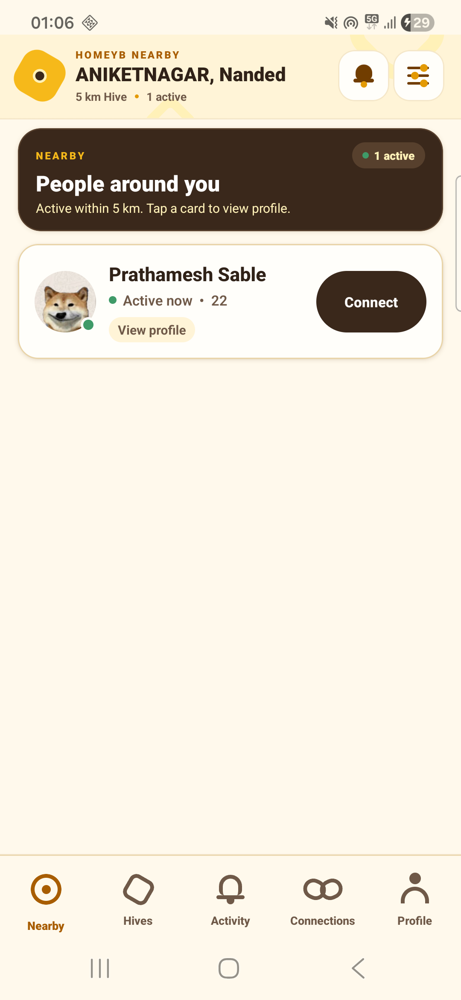
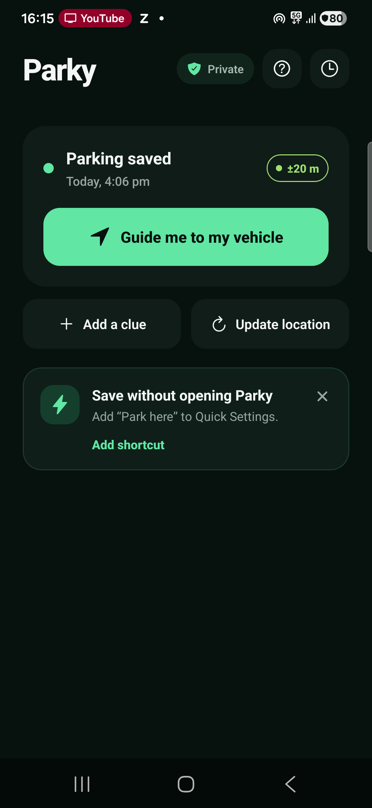

# Prathamesh Sable — Product & Business Analysis Portfolio

**Technical Business Analyst · Product Operations · Associate Product Manager**

I am a product-minded IT professional with 15 months of enterprise technology experience at Tata Consultancy Services and hands-on ownership of two working Android products. My work combines problem framing, requirements, process analysis, SQL/BI thinking, product trade-offs, technical delivery, testing, and release preparation.

[LinkedIn](https://www.linkedin.com/in/prathamesh-sable-04aa8421a) · [GitHub](https://github.com/Prathamesh-S) · [Email](mailto:prathameshsspatil2000@gmail.com)

## Selected product work

### HomeyB — Co-Founder & Product Lead

Privacy-aware hyperlocal Android product for discovering nearby people, participating in location Hives, sharing timely Highlights, and continuing useful interactions through mutual consent.

I lead problem framing, MVP definition, requirements, prioritisation, product behaviour, privacy and safety rules, infrastructure-cost decisions, technical execution, issue investigation, and release readiness. My co-founder contributes feature input, multi-device testing, defect feedback, release validation, and Play Console coordination.

**Evidence:** [HomeyB public product portfolio](https://github.com/Prathamesh-S/HomeyB-Product-Portfolio)

### Parky — Independent Product Builder

Private, offline-first Android parking-memory product using fresh GPS sampling, transparent accuracy, optional contextual clues, and offline compass guidance. It requires no account, backend, analytics, embedded map, or recurring infrastructure.

I took Parky from JTBD and MVP definition through requirements, prioritisation, implementation, physical-device validation, and release preparation.

**Evidence:** [Parky public product portfolio](https://github.com/Prathamesh-S/Parky-Product-Portfolio)

## How I work

| Capability | Evidence from the products |
| --- | --- |
| Problem framing and JTBD | Immediate local context and consent in HomeyB; parking recall as location plus memory in Parky |
| Requirements and delivery | PRDs/BRDs, business rules, user stories, acceptance criteria, traceability, and UAT |
| Product judgement | Freshness versus cost, privacy versus convenience, automation versus control, and scope versus evidence |
| Analysis and measurement | North Stars, funnels, guardrails, experiment plans, SQL analysis examples, and validation boundaries |
| Technical fluency | React Native, TypeScript, Firebase/Cloud Functions, SQLite, Android integrations, Git/GitHub |
| Operational discipline | Physical-device testing, incident investigation, failure recovery, release gaps, and production-risk awareness |

[Open the detailed skills evidence matrix](evidence/Skills_Evidence_Matrix.md)

## Professional foundation

At TCS, I worked as an Assistant System Engineer in enterprise technology operations, reporting, and analysis. The experience developed transferable capability in SQL, Excel/Power BI reporting, incident and root-cause analysis, SLA-controlled operations, documentation, stakeholder coordination, production risk, continuity, and change control.

## Resumes

- [Associate Product Manager / Product resume](resumes/Prathamesh_Sable_APM_Product_Resume.pdf)
- [Technical Business Analyst / Product Operations resume](resumes/Prathamesh_Sable_BA_ProductOps_Resume.pdf)

## Evidence boundary

The products are working proof of execution, but I do not claim measured production retention, revenue, product-market fit, or formal research that has not occurred. Private application code, secrets, signing material, production configuration, and user data are intentionally excluded from all public portfolio repositories.
